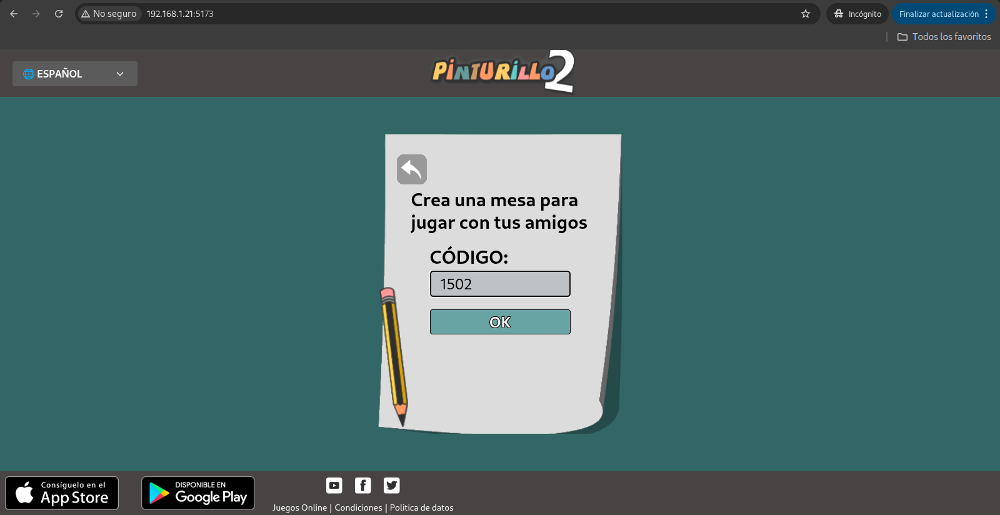
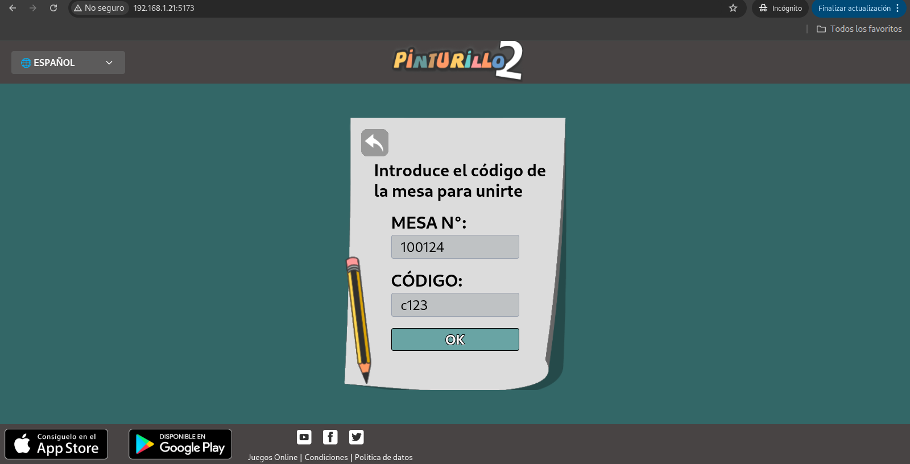
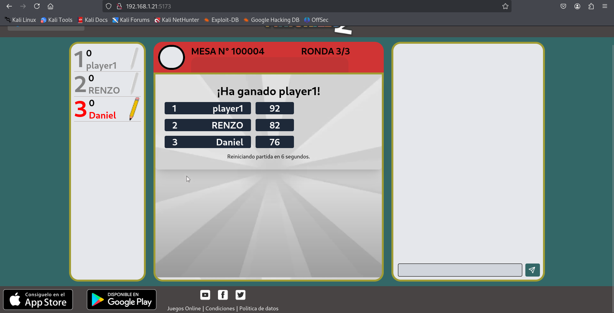

# Clon del juego Pinturillo2

Clon del juego Pinturillo2 (https://www.pinturillo2.com/es/) desarrollado con Node.js-Express-Socket.io y React. 

## Sobre el Juego

Pinturillo es un juego de dibujo online, en el que los jugadores deben adivinar palabras mediante los dibujos que realiza el artista en la pizarra. Con un tiempo limitado por ronda, los jugadores deberán escribir las palabras en el chat hasta acertar. Cuanto antes acierten, más puntos ganarán. Con el boton "!A JUGAR!" te unes a una partida publica.

## Inicio rápido con Docker

### Configurar el archivo `.env` de ejemplo

Modificar `.env` de ejemplo:
```
NODE_PORT=3000
HOST_IP=192.168.1.21  # ¡MODIFICAR! Reemplaza con tu IP local
VITE_API_URL=http://${HOST_IP}:${NODE_PORT}
```

### Levantar los contenedor y acceder a la aplicación web

```
docker compose up --build
```

Accede a la aplicación web desde cualquier dispositivo en tu red local usando: `http://HOST_IP:5173` (En el ejemplo: `http://192.168.1.21:5173`)

<p align="center"> 
    
</p>

  - Gestión de Salas

<p align="center"> 
    
    
</p>

  - Gameplay

<p align="center"> 
    
</p>

  - Fin de Partida

<p align="center"> 
    
</p>


  
    


    


    