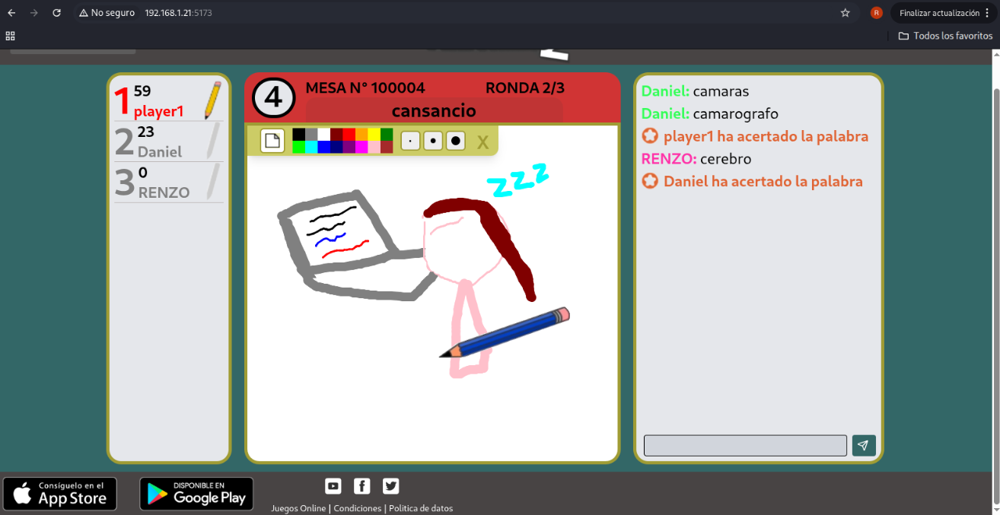

# Clon del juego Pinturillo2
Clon del juego Pinturillo2 (https://www.pinturillo2.com/es/)

## Sobre el Juego
En proceso...


## Configuración

### Setup .env
Modificar frontend/.env - Ejemplo:

```
VITE_API_URL=http://192.168.1.10:5000
```
### Inicio rapido con Docker
```
git clone https://github.com/RenzoQuispe/ClonePinturillo2.git
cd ClonePinturillo2
docker-compose up --build
```

